# music-detr

music information retrieval (MIR)


项目基于 [open-det2](https://github.com/Med-Process/Open-Det2)

识别音乐的重要音符，并给出音色的自然语言描述

数据标注困难时，例如音乐理解，
短上下文识别结果做 LALM 的结构提示。
实现逐个元素的理解，避免 LALM 犯错。

用detr提取cqt上的稀疏结构，并对每个目标做自然语言描述。

在后续工作中，着重于解释各个目标的关系，例如音色之间的依赖。

# 具体架构

我现在有两个做法，我不是要从音高谱(P, T) (pitch, time)去预测真是midi (P, T) 嘛，因为形状一样所以可以用U-net，但是音高谱信息不足，所以需要去融合audio_emb的信息，大概就是用注意力去融合，但是我有两种做法，我不知道怎么处理(P,T) 1、我直接把P嵌入特征，(P, T) -> (C, T) -> (C*8, T//2) -> (c*32, T//4)... -> (C, T) -> (P, T) 2、我需要开一个新特征, (P, T) -> (1, P, T) -> (8, P//2, T//2) -> (32, P//4, T//4) -> ... -> (8, P//2, T//2) -> (1, P, T) -> (P, T)

我之所以要想到方案1，是因为我觉得直接做方案2会有问题，因为conv2d需要保证连续的像素对应同一个实体，时间上确实是连续的，但是P维度上，一个实体可能要跨越12个像素，7个像素（泛音、谐波），所以不能用常规的卷积做。但是如果我提前就在P维度做一个linear，就有希望把这些特征变成连续的，所以我就想到方案1，或许更稳妥一些

在P维度做attention，最稳妥。

说的对，我应该用局部注意力(P * Delta_t, C)，同时也要注意到局部位置的audio_emb编码 (Delta_t, C)，但是你觉得是用audio_emb好（wav2vec2之类的），还是直接用原始的频谱特征好，我用这个是因为能量谱可能有相位问题。而且还有一个问题，这样的话 (P * Delta_t, C) 尺寸就不会改变，也就是可以直接做残差连接，也就没必要Unet了

现在我们来想想策略，应该设计成因果的还是无因果的，如果是因果的，每次只预测下一个 (P, 3) （3表示[静止，触发，延续上一个音]），还是设计成全局的，直接预测(T, P, 3)


我突然意识到我可以直接把freq本身当作它的F编码，比如说对100->20000的频率，直接用sin(freq * k / d)和cos 当作编码，这样pitch_spec和spec的语义空间就对齐了，concat后可以直接做注意力

# 第一次冲击
3/30

把所有人展平之后，会出现 out of memory,

`[text_emb, pitch_emb, freq_emb]`

三个人下来，长度是 `1+ T*P + T*F = 1 + 117*85 + 117*128 = 24922`

这个上下文也太长了吧，我们首先应该压缩上下文长度，要不然要计算
`(24922, C) @ (C, 24922)`，结果是 `621106084`

主要是如果我把频率和时间分别做attention，我就没办法解码 text 了，我心中最理想的情况是，如果 [text, pitch, freq] 直接self_attn，那text位置后续就可以作为query了，这个query会同时把pitch变成target，同时把自己变成text_prompt，这个prompt经过一个语言模型就得到了text

但是如果我分别做的话，我能把text融合给它们，但是我不知怎样把它们融合给text。

然后chatgpt告诉我，可以做双向attention，就是说 freq, pitch 之间
做 factorized 的 self attention，
然后他俩分别和 text 做 crossAttention，

然后 text, 和 [freq, pitch] 分别经过不同的 FFN，

这就有2个问题，
1、首先，text应该做self attention吗，如果不做的话，[pitch, freq]那边做了一个self和一个cross，text这边只做一个cross，感觉不太对称。
2、其次，text这边本身就是用text encoder提取的，哦哦，后续会替换成query，这样的话self attention的确要做，突然就感觉十分的合理。但是detr的self attention是在不同的类型之间做的，也就是在 N 维度上，顺带一说，text_emb 的维度是 `(N, L, C)`，其中 N 是不同的类别，L 是截取的句子长度。但是如果是detr的话，应该是 `(B, N, C)` 才对，也就是说 query 是在 N 之间做注意力的。

但是另一边，[pitch, freq] 似乎没有在 N 方向上做。因为我们需要让 pitch 在 N 方向上表示不同的类别。我们一开始只用了查询的思路。直接把N当成了不同的batch。

也就是说目前的思绪其实是有点乱的。难道说真实的做法是，[pitch, freq]要在 在 F, T, N 三个方向做注意力然后相加。在 N 方向做的时候把 query 镶嵌在前面，同时通过一个N编码让特定的n和 n的 query 能互相认识。

好饿，我得去吃会。

ok我回来了。
现在我们来写 DecoderLayer，
先做 F, T 的 self_attn
然后和 text 做 cross_attn
权重矩阵是 `L * F*T * 2` 个，挺好的。

还有一个法子，就是crossAttention的时候，直接就把text加上。

哎呀我去，3/30 19:43，显存没爆炸，前向传播完成

# first hope

4/6
transformer works better than cqt
something that cqt cannot capture
transformer does well

1. time mask
2. supervise signal, both sustain and trigger

好了，今天训练的效果比较正常了，但是离能用还差得远。
具体来说，今天做好了 textwise 的样本加载，
我发现相关性是比较重要的，
比如说在text的提示中，应该加入演奏的方法，甚至具体到和弦
另一个极端，就是只指明这个乐器是combo
我发现这个就比较接近query了，
如果我输入的是combo，输出的时候变成了 combo，funk guitar，这样就非常好，
再极端一点，直接是一个query，
嗯，能感觉到一点了。
不过如果我text里面如果没有指明pitchless，
有的bass是pitch，有的是pitchless的，
model似乎无法通过频谱判断出应该做哪种的bass，
这个事情我觉得不能加上额外的提示了！
它必须从数据规律中学到，而不是从query中，
换种想法，如果query输入没有pitchless的提示，
然后我在预测中希望query有pitchless的信息，
这样或许能帮助pitch预测到pitchless位。

嗯，作为query条件的text和作为要预测的细节text，这个要区分开

今天的效果大概是这样，这是比较好的，左边的是模型预测的，中间的是gt，右边的是cqt原始特征

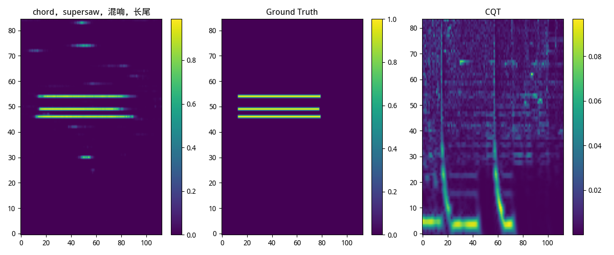

这个成功的原因，我猜可能是 text 取得很好

我们选了一些，现在来逐个点评一下

## 比较好的

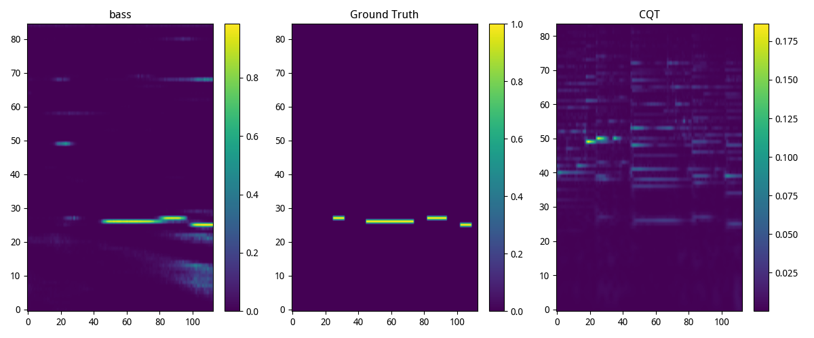

这个发现了bass，而且能从cqt中分离并强调，也许是因为text很简单

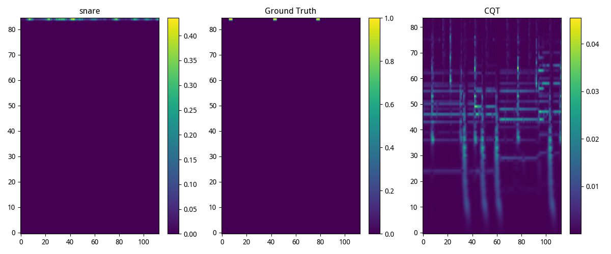

这个至少把不同的snare区分开了，虽然没有完全对齐，也许是因为cqt里的那个竖线很明显

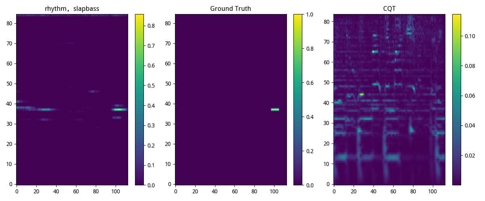

这个还可以，找到了，但是也有可能是小样本的过拟合，有可能只是把这个text向量记住了而已

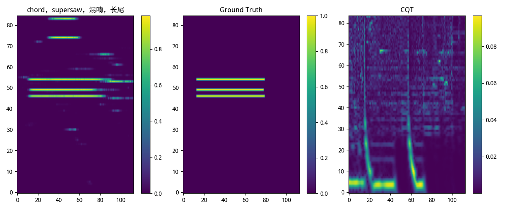

又是supersaw，也许这个比较容易学到，但是这个织体，有可能是和钢琴的chord混淆了，因为钢琴作为chord的时候有这种复杂的织体。所以似乎没有很好的区分，也有可能是相似的特征导致的多出

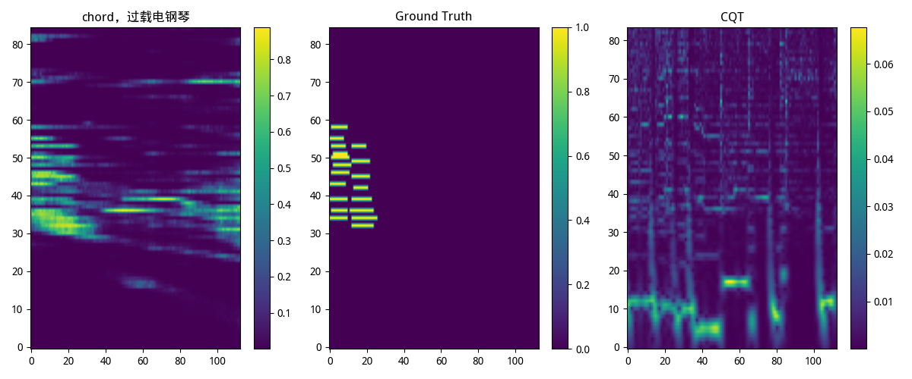

这个过载电钢琴位置还挺对的，也有可能是小样本的缘故，然后chord这个分量让它联想起了复杂织体（我猜）

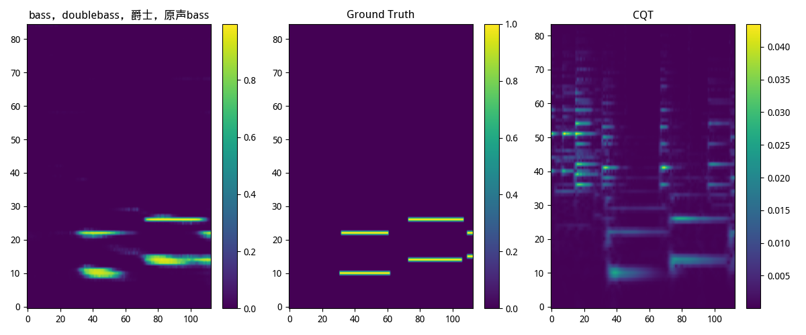

这个确实很不错，doublebass的位置都对了，不断改进之后应该没问题

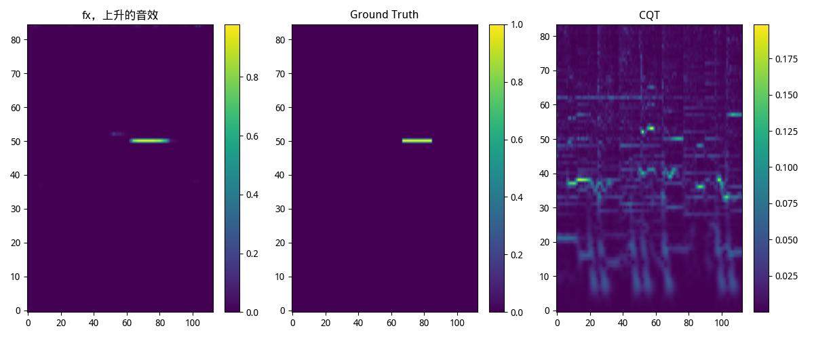

这个 fx 的位置也对了。

## 糟糕的

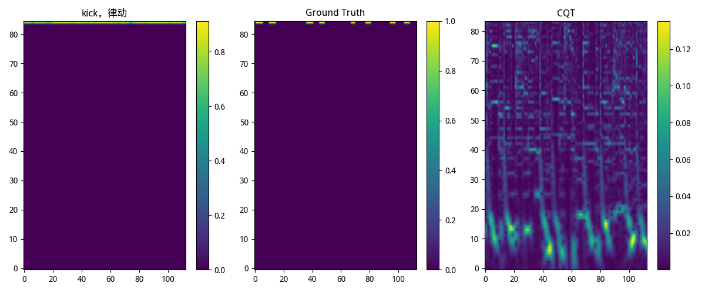

不能把kick区分开，也许区分开并不能造成很好的奖励，因为空出的那些不是很重要，也许应该对pitchless采用不同的策略

此外，即使是pitchless也应该区分trigger和sustain的，这个之前一直没有注意。

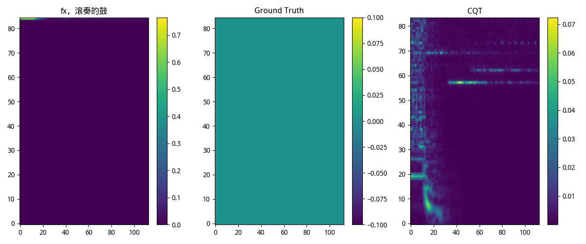

数据集还是有问题，为啥这个gt是空的，预处理的时候检查过了，
也许是因为截掉了开头和结尾导致的，对，就是这个原因！

所以即使 gt 错了，fx 也是对的，很好，这说明text向量起作用了

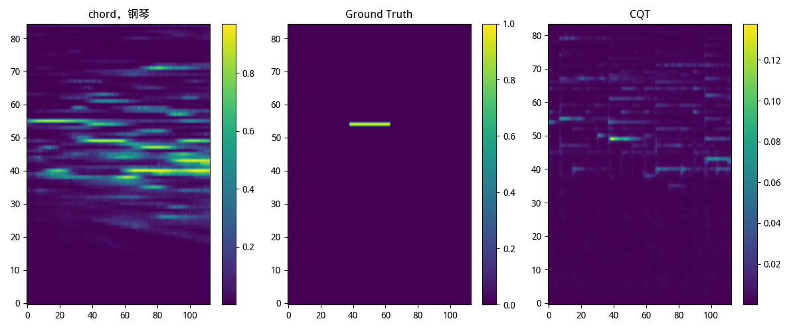

这个是啥情况，为啥gt只有这一个...看cqt的样子这个钢琴很多啊，应该检查数据集标注

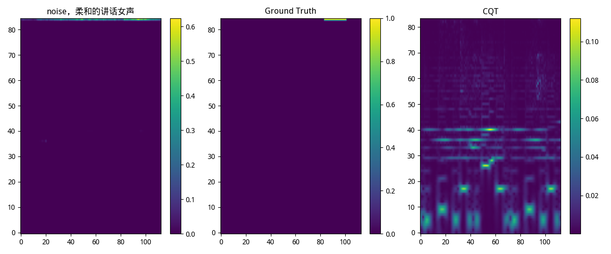

至少分配在pitchless轨

## 中立的

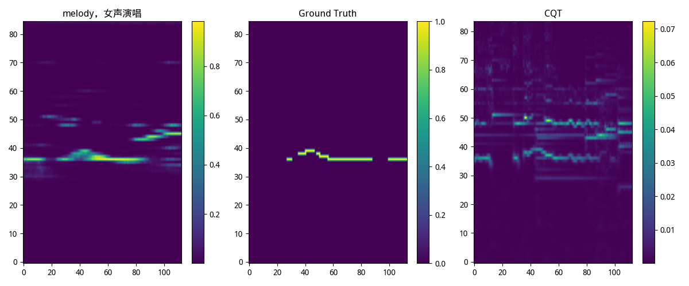

还是不能很好的区分，混进去了很多，似乎是钢琴的东西，也许是因为melody让它们想起钢琴，或许文本编码器是需要训练的？这不行，没这个资源。

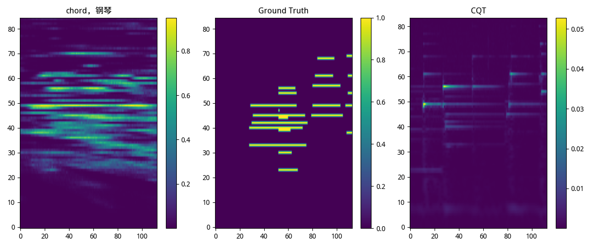

woc，好大一坨，而且这个标注也太不科学了，为啥会这样写钢琴啊，从cqt看完全不是这样的吧

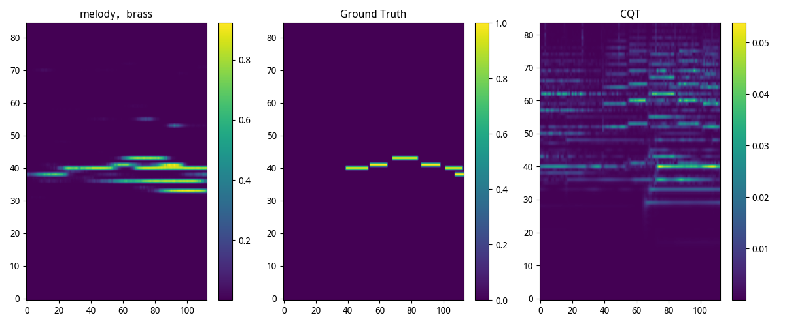

这个brass那么多谐波，都没法精确捕捉吗

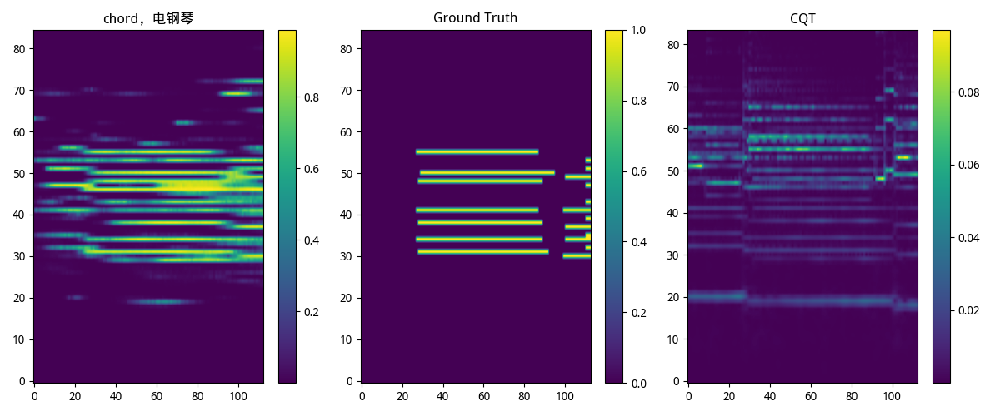

好乱，不过能看出是chord

真的需要完善一下标注方法

# 4/7

今天要开始构思tokenizer了
我想仿照 bpe 进行曲谱的编码

1. 如果有两种音色在很短的时间出现
2. 如果两个音经常以某种节律出现

我们先来想象，允许跨音色吗？

这样，首先要把样本变成
[(text1, token1), (text2, token2)]
这样就可以。

哦，关于token，我们可以取 T * P * log sustain 个
作为基础的token
但是这样就没有text信息了...

想想一开始的思路，就是
(N, T, F, C)

分别做
(N*T, F, C)
(N*F, T, C) attn_mask

我们是不是可以加一个
(T*F, N, C)

这样就能让各个query之间互相看到了

不过，我们可以hungarian matching的时候只用event
也就是 e 过程只用 event，然后 m 过程加上 text 预测就好了

以及，我们也许可以把query分组，分成 Q = Gq * q
一共 Gq 个小组，每个小组 q 个query，
每个小组整体预测出text描述文本，
这些query要预测出相应的event

先做一个没有bpe的试试

嗯，现在把detr forward完成了，
果然需要一些pool，就可以在显存有限的情况下获得更高的维度

20:17, detr loss test ok

# 4/8

00:35

今天写了 detr 
现在有一点样子了
明天先把 al 联合训练写好，再提高性能

今天的效果是这样，虽然有时候不如昨天的framewise
但是结果很确定

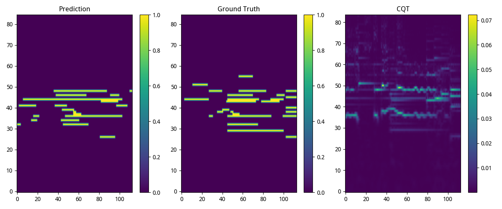

捕捉到那个小连音，但是不是很精确

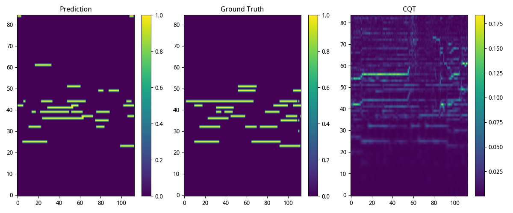

有一点能把握织体了

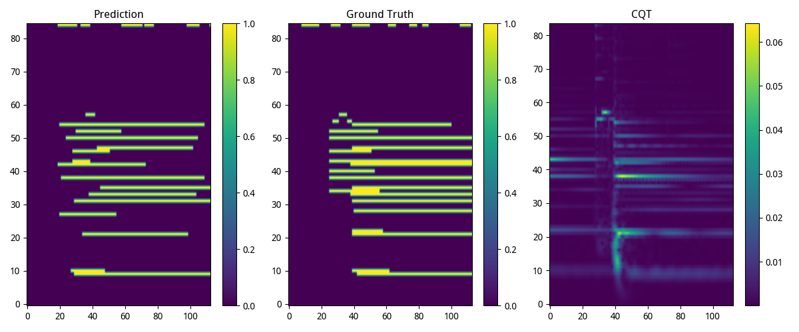

pitchless 的节奏有一点意思，比昨天好一些，昨天pitchless 完全没办法

# 4/8 早上

你有两个选择：
1、
要进行两次 hungarian matching
第一次对 text 进行匹配
第二次在 text 内部对 event 和 pitch 进行匹配
2、
和以前一样把Qe和Qt拼接起来，只进行一次

这两个选择都有一些挑战
2的难点：如果每个组内被分配到了不同的音色咋办
1的难点：假如有几个组被分给了同一个乐器，如果event query不够咋办，这就需要提升组的数量，我们需要确保某个音色被分配了足够的组。也就是说，target的text可能需要复制多份自己，如果没组的query是Qg，那就要复制 ceil(N / Qg) 个自己。

对，因为text的存在是比event在哪里更重要的
这个分级确实可以

不过这样仍然有 text 一致性的问题，ceil(N / Qg) 个 text 是一致的呢。

也许我们可以暴力一点，把 Qg 设置的非常大，这样一个组就绝对够了。
或者，也许经过训练，这些输出能够差不多相同吧。

我去，我突然想到，也许每个 text 可以有很多query，
其中第一个是 cls_distillation，后面那些用来预测文本

但是这样的话，attention 的时候是不是要先做组间的

17:41

大概把带有cell的detr2搭好了，我先吃个饭去，回来写数据集和test，要注意数据集的pitch，别的就没啥了，跑通test和train之后，就可以做audio-language了

20:38

ok，现在 group query 的 detr 总算是开始训练了
这个灵感来源于细胞膜

就是细胞膜上的受体蛋白receptor会收到外界的信息因子
然后这个信息因子就会一路传递到细胞核里
这个信息因子就会和DNA上的启动子结合，
然后RNA聚合酶就会挂到上面，开始转录，
然后核糖体翻译出肽链，然后折叠出蛋白质

然后我就想着，每个组只有少数几个token，也就是细胞膜的receptor，
和其他的modal进行注意力计算，融合信息，
然后，每个细胞独立的进行工作，也就是inner_decoder，
每个cell分为几个部分，
5个 receptor token 用来获得外部信息，
1个 distillation token 用来对齐文本编码
16个 prompt token 接一个LLM用来预测文本
20个 event token 用来预测事件

好了，现在我们就可以开始做audio-language了

哎？不对劲呀，为啥 start 都在左边...

22:22

开始联合模型，
首先要选一个语言模型

哎，detr2的精度差一些

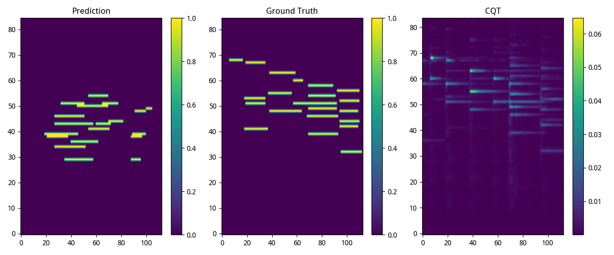

不过现在和 llm 的接口已经好了，
接下来就可以联合训练了，
这样一来就能约束 detr2 了。

# 4/10

今天把 llm 的接口写好了，
并且把 之前的 tokenizer 改名成 teacher
因为现在要做一个新的 tokenizer 了

因为现在的文本都是
`melody，女声演唱，...细节描述`

用`，`分隔了不同层级

我觉得前两个标签，或者第一个，干脆直接用分类模型，
不要用teacher的句子编码了，
这样对于 hungarian match 不友好。

也就是说，标签是服务于 hungarian match 的，
也就是 e 过程，
然后 m 过程需要 llm loss 的加入。
llm 可以着重预测最后一个细节描述。

一般来说，最后的细节描述里，不要有tag可以描述的事情，
否则我们还不如直接做成tag呢。
甚至可以是演奏方法，这样也方便和midi对齐。

还有一个bug，就是关于pitch和pitchless的事情，
我觉得这两个不能直接做softmax
而是每个东西都要做pitch预测
只不过有一个独立的 pitchless BCE
因为存在粗标注的数据，那些数据只标注了位置，
或者这一类数据只训练 event loss，

22:50

现在把tokenizer弄好了，
现在我们来写prompt的拼接

23:40

对于我们的短序列任务，应该减少 cfg.llm.rope_base
目前序列的平均长度是 10，最长是 22，
所以我们最好用20作为rope_base，

```
inv_freq = 1.0 / (
    base ** (torch.arange(0, dim, 2, device=device).float() / dim)
)
```

根据这个公式，0维度的position_ids周期就是1，最后一维的周期是 base，但是base=10000太大了，而max_len只有22，有很多大周期都没有经历过一个完整的周期，太浪费，而且我就是从头训练的，可以把base改成50左右，这样大多数周期都能完整经历

诶，我突然又想到，也许可以直接用所有的 events 来做 hungarian match，
这样注意力权重也许会跑到 cqt 的相应位置，
有助于文本预测。
之后可以试试，先把眼下这个跑通。

# 4/11

00:55

现在算是把 ALUnion 实现了，把 llm 的多模态做了，主要是加了个 prefix attention mask，注意力流动方向:
prefix 双向 prefix
prefix 流向 suffix
suffix 因果 suffix

1:41

ok，get loss 跑通了，明天写好可视化，然后就训练

天雨娘人，
兄走随去

13:23

开始写。
先想一下怎么可视化，
这次主要突出一个文本生成，
也就是说，既有event又有文本。
首先写一个llm多步推理。

# 4/12

好了，现在AL训练和可视化都写了，

下一步我们要完善hungarian matching
也就是说，text层面的hungarian matching
需要直接应用 event 的 总cost

19:19

好了，现在把 match text 的 total_event + text 的 union cost 写好了，具体来说就是遍历所有的 Qt 和 Nt 计算 total event cost，不是很复杂。

已经开始训练

现在我们来想想下一个问题，就是 Qe 的密度问题

但是好像也不是什么大问题，
我觉得可以从数据标注那里去解决这个问题，
所以模型的工作基本上就做好了，
之后就专注于数据标注了。


# 4/17

我们要利用左右信号的和与差，和信号是mono，差信号是side，
所以输入通道维度必须是2。因为音乐会把低频乐器摆放在中间。

